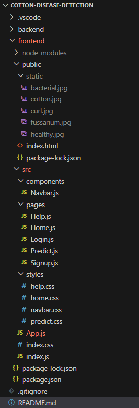
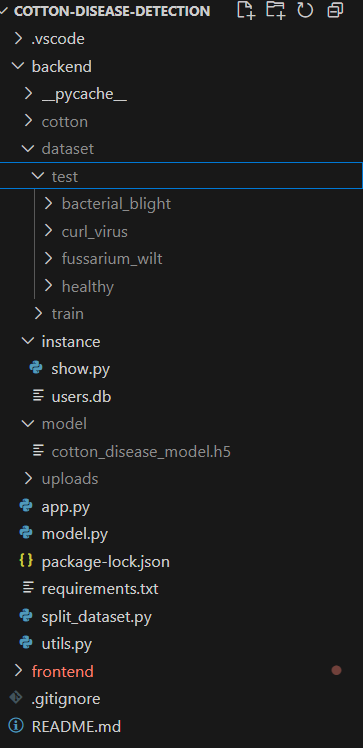

## Dataset  
You can access the dataset here: [Cotton Leaf Disease Dataset](https://www.kaggle.com/datasets/seroshkarim/cotton-leaf-disease-dataset)

## Hierarchy Structure  

Below is the high-level structure of our project, divided into **Frontend** and **Backend** components.

### Frontend  
- Handles user interface and experience.  
- Communicates with the backend via API requests.  
- Built using modern web technologies.  

### Backend  
- Manages business logic and database interactions.  
- Provides API endpoints for frontend communication.  
- Ensures security, scalability, and performance.  

### Architecture Overview  
  
  
